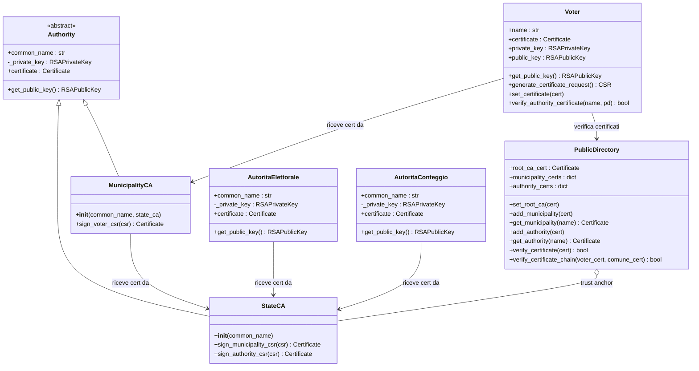
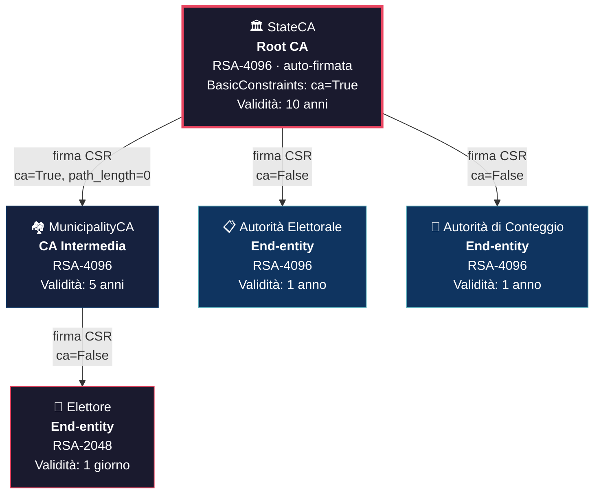
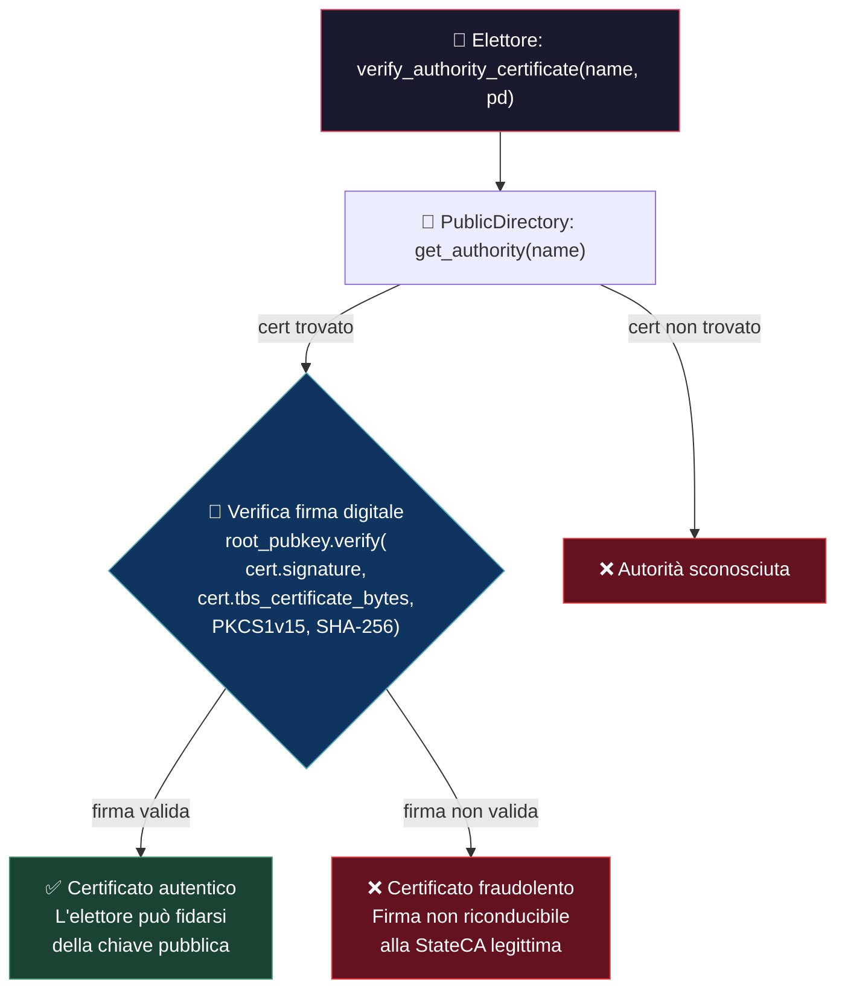

# WP4: IMPLEMENTAZIONE DEL PROTOCOLLO

Questo capitolo ha l'obiettivo di mostrare l'implementazione del protocollo progettato e di cui si è discusso nei capitoli precedenti. Il protocollo è stato implementato come applicazione stand-alone in Python utilizzando il paradigma object-oriented per la modellazione delle entità coinvolte.

## 4.1 Ambiente Simulato

Il protocollo è stato implementato come applicazione stand-alone in Python, utilizzando la libreria `cryptography` (pyca/cryptography) per tutte le operazioni crittografiche. L'ambiente simula l'interazione tra le entità del sistema elettorale senza necessità di un'infrastruttura di rete reale: ogni entità è modellata come un oggetto Python, e i messaggi scambiati (CSR, certificati, risposte di verifica) sono rappresentati come strutture dati X.509 conformi allo standard RFC 5280.

L'intera simulazione è orchestrata dallo script `example_run.py`, che istanzia tutte le entità e riproduce sequenzialmente le fasi del protocollo.

---

## 4.2 Elementi Principali

Il progetto è organizzato in tre package Python — `pki`, `entities` e `archive` — ciascuno con una responsabilità ben definita. Di seguito si descrivono le classi implementate, le scelte progettuali adottate e le relazioni tra di esse.

### Riepilogo delle classi implementate

| Package | Classe | Tipo entità | Chiave RSA | Validità cert | Ruolo nel protocollo |
|---------|--------|-------------|------------|---------------|----------------------|
| `pki` | `Authority` | Classe base (astratta) | 4096 bit | — | Astrazione comune a tutte le CA: gestisce generazione chiavi e incapsulamento della chiave privata |
| `pki` | `StateCA` | Root CA | 4096 bit | 10 anni | Trust anchor del sistema. Certificato auto-firmato. Firma i certificati di Comuni, AE e AC |
| `pki` | `MunicipalityCA` | CA intermedia | 4096 bit | 5 anni | Rappresenta il Comune. Emette certificati per gli elettori residenti (`ca=True, path_length=0`) |
| `entities` | `AutoritaElettorale` | End-entity | 4096 bit | 1 anno | Autentica gli elettori e distribuisce le schede. Certificato firmato dalla StateCA (`ca=False`) |
| `entities` | `AutoritaConteggio` | End-entity | 4096 bit | 1 anno | Conteggia i voti garantendo pseudoanonimato. Certificato firmato dalla StateCA (`ca=False`) |
| `entities` | `Voter` | End-entity | 2048 bit | 1 giorno | Cittadino-elettore. Genera CSR, riceve certificato dal Comune, verifica certificati delle autorità |
| `archive` | `PublicDirectory` | Registro pubblico | — | — | Punto di distribuzione dei certificati. Esegue verifiche crittografiche della catena di fiducia |

### Diagramma delle classi

---

### Package `pki` — Infrastruttura a Chiave Pubblica

Questo package contiene le classi che modellano le Certificate Authority (CA) del sistema, ovvero le entità abilitate a emettere certificati digitali.

#### `Authority` (classe base)

La classe `Authority` rappresenta l'astrazione comune a tutte le autorità di certificazione. È stata progettata come **classe base** da cui ereditano `StateCA` e `MunicipalityCA`, applicando il principio di ereditarietà per evitare duplicazione di codice.

| Attributo / Metodo | Visibilità | Descrizione |
|---------------------|------------|-------------|
| `common_name` | Pubblico | Nome identificativo dell'autorità (es. "Italy") |
| `_private_key` | Privato | Chiave privata RSA-4096; il prefisso `_` ne indica l'incapsulamento, impedendone l'accesso dall'esterno |
| `certificate` | Pubblico | Certificato X.509 dell'autorità, inizialmente `None` |
| `get_public_key()` | Pubblico | Restituisce la chiave pubblica derivata dalla chiave privata, senza mai esporre quest'ultima |

La scelta di rendere `_private_key` un attributo **privato** è fondamentale: simula il fatto che in un sistema reale la chiave privata di una CA non deve mai lasciare il dispositivo sicuro (HSM) in cui è custodita. L'unico modo per interagire con essa è attraverso i metodi della classe (firma di certificati).

#### `StateCA` (Root CA)

`StateCA` eredita da `Authority` e rappresenta il **trust anchor** dell'intero sistema: la CA radice dello Stato. Il suo certificato è **auto-firmato** — ovvero `subject` e `issuer` coincidono — poiché non esiste un'autorità superiore.

| Metodo                       | Descrizione                                                                                                                                                                          |
| ------------------------------| --------------------------------------------------------------------------------------------------------------------------------------------------------------------------------------|
| `__init__(common_name)`      | Genera chiavi RSA-4096 (tramite la classe padre), poi costruisce e firma il proprio certificato auto-firmato con `BasicConstraints(ca=True, path_length=None)` e validità di 10 anni |
| `sign_municipality_csr(csr)` | Firma il CSR di un Comune, producendo un certificato con `ca=True, path_length=0` — il Comune potrà a sua volta emettere certificati, ma solo per end-entity (non per altre sub-CA)  |
| `sign_authority_csr(csr)`    | Firma il CSR di un'autorità end-entity (AE o AC), producendo un certificato con `ca=False` e validità di 1 anno                                                                      |

La distinzione tra `sign_municipality_csr` e `sign_authority_csr` riflette una scelta architetturale precisa: il Comune è una **CA intermedia** che deve poter emettere certificati agli elettori, mentre AE e AC sono **end-entity** che necessitano solo di rendere pubblica la propria chiave.

#### `MunicipalityCA` (CA Intermedia)

`MunicipalityCA` eredita da `Authority` e rappresenta il **Comune**, l'ente preposto al rilascio dei certificati ai cittadini-elettori. Nel costruttore, genera automaticamente un CSR e lo sottomette alla `StateCA` ricevuta come parametro, ottenendo il proprio certificato firmato.

| Metodo | Descrizione |
|--------|-------------|
| `__init__(common_name, state_ca)` | Genera chiavi, crea CSR, lo invia alla StateCA e memorizza il certificato firmato |
| `sign_voter_csr(csr)` | Firma il CSR di un elettore, producendo un certificato con `ca=False` e validità di **1 giorno** (durata della giornata elettorale) |

La validità di 1 giorno per il certificato dell'elettore è una scelta di sicurezza: limita la finestra temporale in cui il certificato può essere usato, riducendo i rischi in caso di compromissione.

---

### Package `entities` — Attori del Protocollo

Questo package contiene le entità che partecipano attivamente al protocollo di voto. A differenza delle CA (che emettono certificati), queste entità sono **end-entity**: possiedono un certificato ma non hanno facoltà di firmarne altri.

#### `AutoritaElettorale` (AE)

L'Autorità Elettorale è responsabile dell'autenticazione degli elettori e della distribuzione delle schede di voto. Nel costruttore, genera una coppia di chiavi RSA-4096, crea un CSR e lo sottomette alla `StateCA`, ottenendo un certificato end-entity (`ca=False`).

| Attributo / Metodo | Descrizione |
|---------------------|-------------|
| `_private_key` | Chiave privata RSA-4096 (incapsulata) |
| `certificate` | Certificato X.509 firmato dalla StateCA |
| `get_public_key()` | Espone la chiave pubblica per la verifica da parte degli elettori |

La chiave pubblica dell'AE è resa disponibile a tutti gli elettori attraverso il `PublicDirectory`, permettendo loro di verificare l'autenticità dell'autorità prima di interagire con essa.

#### `AutoritaConteggio` (AC)

L'Autorità di Conteggio è responsabile del conteggio dei voti con garanzia di pseudoanonimato. La struttura è analoga a quella dell'AE: genera chiavi RSA-4096, ottiene un certificato firmato dalla StateCA e rende pubblica la propria chiave attraverso il `PublicDirectory`.

La separazione tra AE e AC in due classi distinte riflette il principio di **separazione dei compiti** (*separation of duties*): l'entità che autentica l'elettore (AE) è diversa dall'entità che conteggia i voti (AC), impedendo che un singolo attore possa correlare l'identità dell'elettore con il voto espresso.

#### `Voter` (Elettore)

La classe `Voter` modella il cittadino-elettore. A differenza delle autorità, l'elettore utilizza chiavi **RSA-2048** — dimensione sufficiente per un certificato a brevissima validità (1 giorno) e che riduce il costo computazionale di generazione.

| Attributo / Metodo | Descrizione |
|---------------------|-------------|
| `private_key` | Chiave privata RSA-2048 |
| `public_key` | Chiave pubblica derivata |
| `certificate` | Certificato X.509 firmato dal Comune (inizialmente `None`) |
| `generate_certificate_request()` | Costruisce un CSR PKCS#10 firmato con la propria chiave privata |
| `set_certificate(cert)` | Memorizza il certificato ricevuto dal Comune |
| `verify_authority_certificate(name, pd)` | Recupera il certificato di un'autorità dal PublicDirectory e ne verifica crittograficamente la firma rispetto alla StateCA |

Il metodo `verify_authority_certificate` è il punto chiave della fase 3 del protocollo: consente all'elettore di **verificare autonomamente** che le chiavi pubbliche di AE e AC siano autentiche, senza doversi fidare ciecamente del PublicDirectory.

---

### Package `archive` — Registro Pubblico

#### `PublicDirectory`

Il `PublicDirectory` rappresenta un registro pubblico accessibile a tutti, che funge da punto di distribuzione dei certificati. È l'equivalente simulato di un servizio di directory LDAP o di un repository di certificati accessibile via rete.

| Attributo / Metodo | Descrizione |
|---------------------|-------------|
| `root_ca_cert` | Certificato della StateCA, usato come trust anchor per tutte le verifiche |
| `municipality_certs` | Dizionario `{nome_comune: certificato}` |
| `authority_certs` | Dizionario `{nome_autorità: certificato}` |
| `set_root_ca(cert)` | Imposta il trust anchor |
| `add_municipality(cert)` / `add_authority(cert)` | Pubblica un certificato, indicizzandolo per `CommonName` |
| `get_municipality(name)` / `get_authority(name)` | Recupera un certificato per nome |
| `verify_certificate(cert)` | **Verifica crittografica**: usa la chiave pubblica della root CA per verificare che la firma sul certificato sia autentica (algoritmo RSA-PKCS#1v1.5 con SHA-256) |
| `verify_certificate_chain(voter_cert, comune_cert)` | Risale l'intera catena di fiducia: verifica che il cert dell'elettore sia firmato dal Comune e che il cert del Comune sia firmato dalla StateCA |

La scelta di separare i certificati in due dizionari distinti (`municipality_certs` e `authority_certs`) riflette la diversa natura delle entità: i Comuni sono CA intermedie, le autorità sono end-entity. Questa separazione rende il codice più leggibile e permette di applicare politiche di verifica differenziate in futuro.

---

## 2. Architettura PKI Gerarchica

Il sistema di fiducia è costruito su una **Public Key Infrastructure (PKI) a tre livelli**, in cui ogni entità possiede una coppia di chiavi RSA e un certificato X.509 firmato dall'autorità di livello superiore.

### Ruoli delle entità

| Entità | Tipo | Chiave RSA | Validità Cert | Ruolo |
|--------|------|------------|---------------|-------|
| **StateCA** | Root CA | 4096 bit | 10 anni | Trust anchor dell'intero sistema. Firma i certificati di MunicipalityCA, AE e AC. Certificato auto-firmato. |
| **MunicipalityCA** | CA Intermedia | 4096 bit | 5 anni | Rappresenta il Comune. Autorizzata a emettere certificati per gli elettori residenti (`ca=True, path_length=0`). |
| **Autorità Elettorale (AE)** | End-entity | 4096 bit | 1 anno | Autentica gli elettori e gestisce la distribuzione delle schede. Non può firmare certificati (`ca=False`). |
| **Autorità di Conteggio (AC)** | End-entity | 4096 bit | 1 anno | Conteggia i voti garantendo pseudoanonimato. Non può firmare certificati (`ca=False`). |
| **Elettore** | End-entity | 2048 bit | 1 giorno | Chiave a 2048 bit (sufficiente per un'entità a breve vita). Certificato con validità limitata alla giornata elettorale. |

> [!NOTE]
> La scelta di `ca=False` per AE e AC è intenzionale: queste autorità non necessitano di delegare fiducia ad altre entità. Il loro certificato serve esclusivamente per rendere pubblica e verificabile la propria chiave pubblica.

---

## 3. Fasi del Protocollo Implementato

Il protocollo di autenticazione si articola in **sei fasi**, eseguite sequenzialmente nella simulazione.

```mermaid
sequenceDiagram
    participant SCA as 🏛️ StateCA
    participant PD as 📂 PublicDirectory
    participant MUN as 🏘️ MunicipalityCA
    participant AE as 📋 Autorità Elettorale
    participant AC as 🔢 Autorità di Conteggio

    rect rgb(26, 26, 46)
    Note over SCA,MUN: FASE 0 — Setup della PKI
    SCA->>SCA: gen_key(RSA-4096) + cert auto-firmato
    MUN->>MUN: gen_key(RSA-4096)
    MUN->>SCA: CSR (subject=Comune)
    SCA->>MUN: Certificato firmato (ca=True)
    end

    rect rgb(15, 52, 96)
    Note over AE,AC: FASE 1 — Creazione delle Autorità
    AE->>AE: gen_key(RSA-4096)
    AE->>SCA: CSR (subject=AE)
    SCA->>AE: Certificato firmato (ca=False)
    AC->>AC: gen_key(RSA-4096)
    AC->>SCA: CSR (subject=AC)
    SCA->>AC: Certificato firmato (ca=False)
    end

    rect rgb(22, 33, 62)
    Note over PD: FASE 2 — Pubblicazione nel Public Directory
    SCA->>PD: Certificato root (trust anchor)
    MUN->>PD: Certificato Comune
    AE->>PD: Certificato AE
    AC->>PD: Certificato AC
    end
```

```mermaid
sequenceDiagram
    participant SCA as 🏛️ StateCA
    participant PD as 📂 PublicDirectory
    participant MUN as 🏘️ MunicipalityCA
    participant V as 👤 Elettore

    rect rgb(15, 52, 96)
    Note over V,PD: FASE 3 — Verifica certificati AE e AC
    V->>PD: get_authority("AE")
    PD-->>V: cert_AE
    V->>PD: verify_certificate(cert_AE)
    PD-->>V: ✅ valido
    V->>PD: get_authority("AC")
    PD-->>V: cert_AC
    V->>PD: verify_certificate(cert_AC)
    PD-->>V: ✅ valido
    Note over V: L'elettore ora possiede<br/>le chiavi pubbliche di AE e AC
    end

    rect rgb(100, 18, 32)
    Note over V,PD: FASE 4 — Test di sicurezza
    Note right of V: CA falsa tenta di inserire<br/>un'autorità fraudolenta
    V->>PD: verify_certificate(cert_AE_falsa)
    PD-->>V: ❌ firma non valida
    end

    rect rgb(26, 26, 46)
    Note over V,MUN: FASE 5 — Autenticazione dell'Elettore
    V->>V: gen_key(RSA-2048)
    V->>MUN: CSR (subject=Elettore)
    MUN->>V: Certificato firmato (ca=False, 1 giorno)
    V->>PD: Verifica catena: cert_V → Comune → StateCA
    PD-->>V: ✅ catena valida
    end
```

### Fase 0 — Setup della PKI

La `StateCA` genera una coppia di chiavi RSA-4096 e crea il proprio certificato auto-firmato (root of trust). Successivamente, la `MunicipalityCA` genera le proprie chiavi, costruisce un **Certificate Signing Request (CSR)** e lo sottomette alla StateCA, che risponde con un certificato firmato con estensione `BasicConstraints(ca=True, path_length=0)`, autorizzando il Comune a emettere certificati esclusivamente per end-entity (gli elettori).

### Fase 1 — Creazione delle Autorità AE e AC

Ciascuna autorità genera la propria coppia di chiavi RSA-4096, costruisce un CSR e lo invia alla StateCA. A differenza della MunicipalityCA, i certificati emessi per AE e AC hanno `BasicConstraints(ca=False)`: queste entità non hanno bisogno di delegare fiducia, ma solo di rendere la propria chiave pubblica verificabile.

### Fase 2 — Pubblicazione nel Public Directory

Il `PublicDirectory` funge da registro pubblico dei certificati, accessibile a tutti gli elettori. In questa fase vengono pubblicati:
- Il **certificato root** della StateCA (trust anchor per tutte le verifiche)
- Il **certificato del Comune**
- I **certificati di AE e AC**

Ogni certificato è indicizzato per `CommonName` (campo `subject` del certificato X.509).

### Fase 3 — L'Elettore verifica i certificati di AE e AC

Prima di procedere con il protocollo di voto, l'elettore deve conoscere e fidarsi delle chiavi pubbliche di AE e AC. L'elettore:
1. Recupera il certificato dell'autorità dal `PublicDirectory` tramite il suo nome
2. Invoca la **verifica crittografica della firma**: la chiave pubblica della StateCA viene usata per verificare che la firma digitale sul certificato sia autentica

### Fase 4 — Test di sicurezza (CA fraudolenta)

Per dimostrare la robustezza del sistema, la simulazione include un test in cui un attaccante crea una StateCA falsa e da essa deriva un'autorità elettorale fraudolenta. Il certificato dell'AE falsa viene inserito nel PublicDirectory, ma quando l'elettore tenta di verificarlo, la verifica crittografica **fallisce**: la firma sul certificato non è riconducibile alla chiave pubblica della StateCA legittima registrata come trust anchor.

Questo dimostra che il possesso di un certificato non è sufficiente: **solo la verifica crittografica della catena di fiducia garantisce l'autenticità**.

### Fase 5 — Autenticazione dell'Elettore

L'elettore genera una coppia di chiavi RSA-2048 (dimensione ridotta rispetto alle autorità, poiché il certificato ha validità di un solo giorno), costruisce un CSR e lo sottomette alla `MunicipalityCA` del proprio Comune di residenza. Il Comune firma il certificato dell'elettore con `BasicConstraints(ca=False)` e validità di 24 ore.

Successivamente, la simulazione verifica l'intera **catena di certificati**:
- Il certificato dell'elettore è firmato dal Comune? ✅
- Il certificato del Comune è firmato dalla StateCA? ✅

Questa doppia verifica viene eseguita dal metodo `verify_certificate_chain()` del PublicDirectory, che risale tutta la catena fino al trust anchor.

---

## 4. Primitive Crittografiche Utilizzate

| Operazione | Algoritmo | Dettagli |
|------------|-----------|----------|
| **Generazione chiavi** | RSA | 4096 bit (CA e autorità), 2048 bit (elettori) |
| **Firma digitale** | RSA con PKCS#1 v1.5 + SHA-256 | Usata per firmare certificati e CSR |
| **Verifica firma** | RSA con PKCS#1 v1.5 + SHA-256 | Usata per verificare l'autenticità dei certificati |
| **Formato certificati** | X.509 v3 (RFC 5280) | Con estensioni `BasicConstraints` |
| **Formato richieste** | PKCS#10 CSR (RFC 2986) | Firmato dal richiedente con la propria chiave privata |
| **Hash** | SHA-256 | Per tutte le operazioni di firma e verifica |

---

## 5. Messaggi Scambiati e Dimensioni

La tabella seguente riporta le dimensioni **misurate sperimentalmente** in formato DER (binario) dei certificati X.509 e dei CSR scambiati durante il protocollo. I valori sono stati ottenuti eseguendo `benchmark_auth.py` con nomi reali delle entità.

**Certificati X.509 (DER)**

| Messaggio | Da → A | Formato | Dimensione misurata |
|-----------|--------|---------|--------------------|
| Certificato StateCA (root, auto-firmato) | — | X.509 (DER) | **1.221 byte** |
| Certificato MunicipalityCA | StateCA → MunicipalityCA | X.509 (DER) | **1.234 byte** |
| Certificato Electoral Authority | StateCA → EA | X.509 (DER) | **1.241 byte** |
| Certificato Counting Authority | StateCA → CA | X.509 (DER) | **1.240 byte** |
| Certificato Elettore | MunicipalityCA → Elettore | X.509 (DER) | **972 byte** |

**Certificate Signing Request — CSR (DER)**

| Messaggio | Da → A | Formato | Dimensione misurata |
|-----------|--------|---------|--------------------|
| CSR MunicipalityCA | MunicipalityCA → StateCA | PKCS#10 (DER) | **1.123 byte** |
| CSR Electoral Authority | EA → StateCA | PKCS#10 (DER) | **1.136 byte** |
| CSR Counting Authority | CA → StateCA | PKCS#10 (DER) | **1.135 byte** |
| CSR Elettore | Elettore → MunicipalityCA | PKCS#10 (DER) | **601 byte** |

**Totali**

| Aggregato | Valore |
|-----------|--------|
| Totale setup PKI (una tantum: root cert + 3 CSR + 3 cert autorità + cert comune) | **8.330 byte** |
| Totale per singolo elettore (CSR + certificato) | **1.573 byte** |

> [!NOTE]
> I certificati RSA-4096 (CA e autorità) risultano circa il 25% più grandi rispetto ai certificati RSA-2048 dell'elettore (≈1.240 vs ≈972 byte). Analogamente, i CSR RSA-4096 (≈1.130 byte) sono circa il doppio dei CSR RSA-2048 (601 byte). Il costo in byte del setup (8,1 KB) è trascurabile ed è sostenuto una sola volta per tutta la durata dell'elezione.

---

## 6. Operazioni di Verifica e Costo Computazionale

I dati riportati in questa sezione sono stati raccolti eseguendo `benchmark_auth.py` sulla macchina di sviluppo (macOS, Apple Silicon). Ogni misura è stata ripetuta per un numero variabile di iterazioni e si riportano media, mediana, deviazione standard, minimo e massimo.

### 6.1 Generazione delle chiavi RSA

| Operazione | Media | Mediana | σ | Min | Max | Iter. |
|------------|-------|---------|---|-----|-----|-------|
| RSA-4096 key generation | **473,06 ms** | 484,52 ms | 285,24 ms | 172,85 ms | 877,92 ms | 5 |
| RSA-2048 key generation | **60,30 ms** | 65,29 ms | 24,67 ms | 18,40 ms | 90,06 ms | 10 |

La generazione RSA-4096 è mediamente **~7,8×** più lenta della RSA-2048. L'elevata deviazione standard (σ ≈ 285 ms per 4096 bit) riflette la natura probabilistica dell'algoritmo: la generazione termina quando si trovano due primi sufficientemente grandi, e il numero di iterazioni necessario varia ad ogni esecuzione.

### 6.2 Firma di CSR e Certificati

| Operazione | Media | Mediana | σ | Iter. |
|------------|-------|---------|---|-------|
| CSR sign (RSA-4096 + SHA-256) | **4,54 ms** | 4,17 ms | 1,62 ms | 20 |
| CSR sign (RSA-2048 + SHA-256) | **0,87 ms** | 0,82 ms | 0,22 ms | 20 |
| Cert sign — authority (CA 4096 → end-entity 4096) | **4,21 ms** | 4,20 ms | 0,07 ms | 20 |
| Cert sign — municipality (CA 4096 → sub-CA 4096) | **4,36 ms** | 4,21 ms | 0,67 ms | 20 |
| Cert sign — voter (CA 4096 → end-entity 2048) | **4,17 ms** | 4,17 ms | 0,01 ms | 20 |

La firma è un'operazione con chiave **privata** (esponenziazione modulare con esponente grande) ed è circa **5× più lenta** della verifica con chiave pubblica. Il tempo di firma è sostanzialmente indipendente dalla dimensione della chiave del soggetto del certificato: è la chiave della CA (RSA-4096) che determina il costo.

### 6.3 Verifica della firma (latenza)

| Operazione | Media | Mediana | σ | Iter. |
|------------|-------|---------|---|-------|
| Cert verify (RSA-4096 pubkey, PKCS1v15, SHA-256) | **0,08 ms** | 0,07 ms | 0,05 ms | 100 |
| Cert verify voter (RSA-4096 pubkey verifica cert 2048) | **0,07 ms** | 0,07 ms | 0,01 ms | 100 |
| Verify EA cert (latenza lato PublicDirectory) | **0,15 ms** | 0,15 ms | 0,00 ms | 100 |
| Verify CA cert (latenza lato PublicDirectory) | **0,15 ms** | 0,15 ms | 0,00 ms | 100 |
| Verify Municipality cert | **0,15 ms** | 0,15 ms | 0,00 ms | 100 |
| Full chain verification (2 verifiche) | **0,30 ms** | 0,30 ms | 0,00 ms | 100 |
| Voter verifies EA cert (via PublicDirectory) | **0,15 ms** | 0,15 ms | 0,00 ms | 100 |
| Voter verifies CA cert (via PublicDirectory) | **0,15 ms** | 0,15 ms | 0,00 ms | 100 |
| Verify FAKE cert (deve fallire) | **0,15 ms** | 0,15 ms | 0,00 ms | 100 |

La verifica con chiave pubblica RSA è **estremamente rapida** (< 0,2 ms per singola operazione) grazie all'esponente pubblico fisso e=65537, che richiede solo 17 moltiplicazioni modulari. La verifica dell'intera catena (2 step: Elettore → Comune → StateCA) richiede circa **0,30 ms**, pari alla somma dei due step singoli, confermando l'assenza di overhead significativo nell'implementazione.

Nota: il certificato della CA falsa (firmato da una StateCA non registrata) fallisce la verifica nello stesso tempo di un certificato valido (0,15 ms), perché il rifiuto avviene per eccezione crittografica e non per early-exit.

### 6.4 Tempi di interazione end-to-end

| Fase | Operazione | Media | Mediana | σ | Iter. |
|------|-----------|-------|---------|---|-------|
| Fase 0 | Create StateCA (keygen + self-signed cert) | **647,72 ms** | 643,14 ms | 415,18 ms | 5 |
| Fase 0 | Create MunicipalityCA (keygen + CSR + sign) | **923,54 ms** | 683,36 ms | 547,06 ms | 5 |
| Fase 1 | Create EA (keygen + CSR + sign) | **763,63 ms** | 612,35 ms | 356,23 ms | 5 |
| Fase 1 | Create CA (keygen + CSR + sign) | **658,82 ms** | 659,56 ms | 489,34 ms | 5 |
| Fase 5 | Full voter registration (keygen 2048 + CSR + sign) | **58,91 ms** | 56,42 ms | 23,24 ms | 10 |
| Flusso completo | Verify EA + CA + registration + chain verify | **67,09 ms** | 62,11 ms | 21,33 ms | 10 |

Il costo totale del setup PKI (Fasi 0 e 1, quattro entità RSA-4096) è dell'ordine di **3–4 secondi**, ma è un costo **una tantum** sostenuto prima dell'apertura dei seggi. Il costo per singolo elettore (≈67 ms) è invece quello rilevante ai fini della scalabilità.

### 6.5 Scalabilità

| N. elettori | Tempo totale | Tempo medio/elettore |
|-------------|-------------|---------------------|
| 10 | 835,74 ms | **83,57 ms** |
| 50 | 3.489,52 ms | **69,79 ms** |
| 100 | 7.739,01 ms | **77,39 ms** |

Il tempo per elettore si mantiene **sostanzialmente costante** tra 70 e 84 ms al variare del carico (10–100 elettori), confermando la complessità **O(n)** lineare nel numero di votanti. Il leggero calo tra 10 e 50 elettori è attribuibile all'effetto warm-up della CPU (cache e branch prediction). Per una singola macchina il sistema è in grado di processare circa **12–15 elettori/secondo**.

### 6.6 Riepilogo e considerazioni

| Categoria | Valore chiave | Nota |
|-----------|--------------|------|
| Keygen RSA-4096 (setup) | ~473 ms/entità | Una tantum, ammortizzato |
| Keygen RSA-2048 (per elettore) | ~60 ms | Bottleneck del flusso per-elettore |
| Firma certificato (CA RSA-4096) | ~4,2 ms | Costo fisso indipendente dal soggetto |
| Verifica singolo certificato | ~0,15 ms | Operazione trascurabile |
| Verifica catena completa (2 step) | ~0,30 ms | Additive, nessun overhead |
| Flusso completo per elettore | ~67 ms | Dominato dalla keygen RSA-2048 |
| Throughput stimato | ~12–15 elettori/sec | Su singola macchina (simulazione) |

---

## 7. Struttura del Codice

| Modulo | File | Classe | Responsabilità |
|--------|------|--------|----------------|
| **pki** | `Authority.py` | `Authority` | Classe base: generazione chiavi RSA-4096, gestione certificato |
| **pki** | `StateCA.py` | `StateCA` | Root CA: cert auto-firmato, firma CSR per Comuni (`ca=True`) e Autorità (`ca=False`) |
| **pki** | `MunicipalityCA.py` | `MunicipalityCA` | CA intermedia: richiede cert a StateCA, firma CSR degli elettori |
| **entities** | `AutoritaElettorale.py` | `AutoritaElettorale` | AE: genera chiavi, ottiene cert firmato da StateCA |
| **entities** | `AutoritaConteggio.py` | `AutoritaConteggio` | AC: genera chiavi, ottiene cert firmato da StateCA |
| **entities** | `Voter.py` | `Voter` | Elettore: genera chiavi RSA-2048, CSR, verifica certificati autorità |
| **archive** | `PublicDirectory.py` | `PublicDirectory` | Registro pubblico: memorizza cert, verifica crittografica firme, verifica catena |
| — | `example_run.py` | — | Script di simulazione: esegue tutte le fasi del protocollo |
